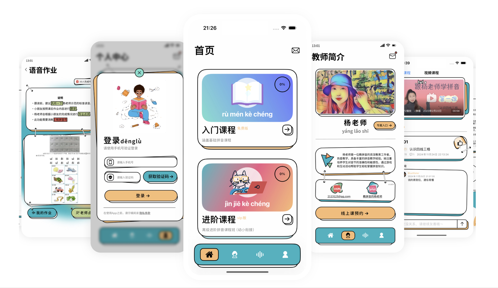

# 杨老师教拼音

<h4>精准纠正拼读发音，全面高效学拼音</h4>

## 简介

  【杨老师教拼音】是一款专为儿童与成人定制的全方位汉语拼音学习App，整合了高质量视频课程与实时互动教学的优势。

这款App以杨老师的丰富教学经验为核心，精心设计了由浅入深的入门及进阶视频课程，让用户无论是在理论知识还是实践技能上都能扎实掌握汉语拼音的基础。

## 功能

   *高清视频课堂：生动详尽的视频教程，杨老师亲自讲解每个拼音字母的发音技巧、声调规则以及易混淆点，让学习过程直观且易于理解。

*个性化线上课程：定期开展的在线直播课程，用户可以直接向杨老师请教问题，获得即时反馈和专业指导，犹如面对面亲授，极大提升了学习效率。

*跟进式语音作业：杨老师独家布置的针对性跟读练习，用户可以按照示范完成语音作业，上传后即可得到杨老师亲自语音批改，精准纠正每一个细微读音错误，确保每一位学员都能说出一口标准的普通话。

【杨老师教拼音】以其独特的教学模式和贴心的一对一辅导服务，让汉语拼音学习变得轻松高效，从理论到实践无缝衔接，帮助使用者自信开口，流利说汉语。

## 屏幕截图

## 联系我们

邮箱：shuqing2023@163.com

微信号： SeedsOfLove_

## 官方介绍

[点击进入官网](http://www.bluewater1412.top)

## 隐私条款

[隐私条款](http://www.bluewater1412.top/MyDocs/PinYinYangPrivacyPolicy.html)

